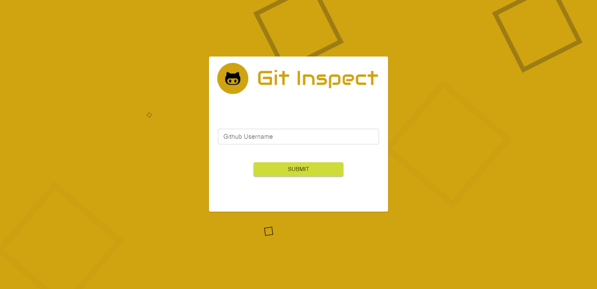
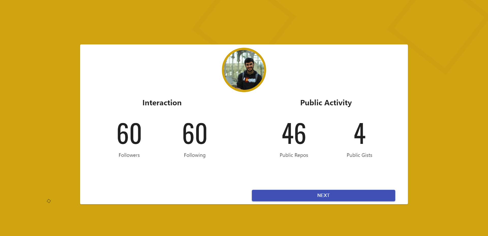
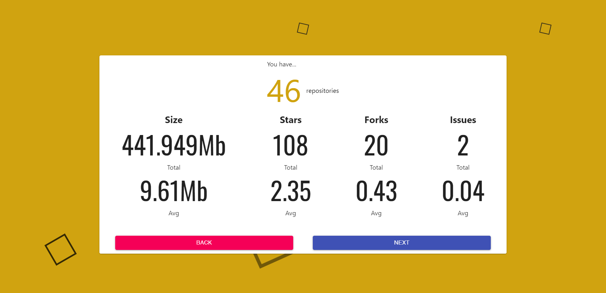
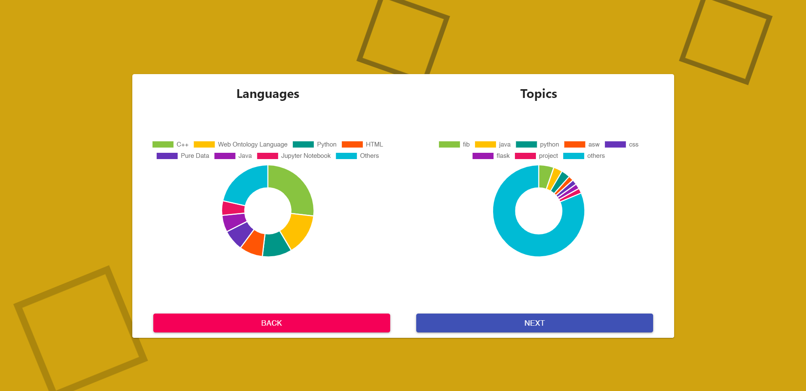
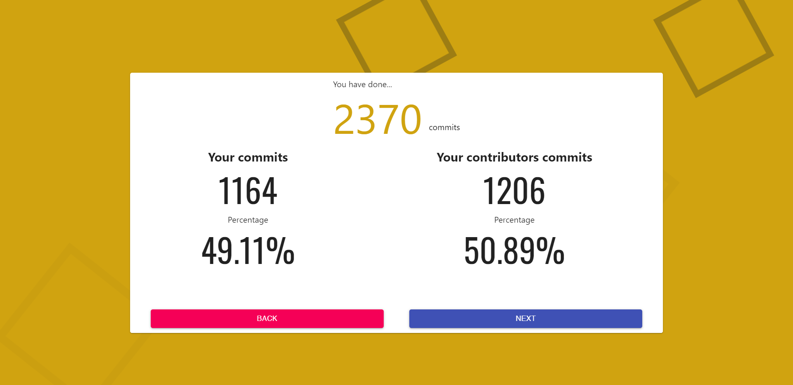
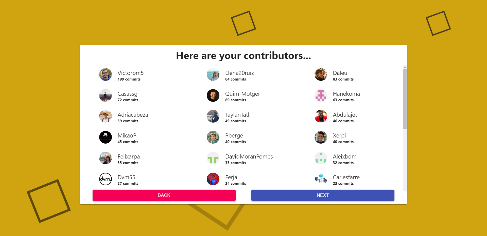
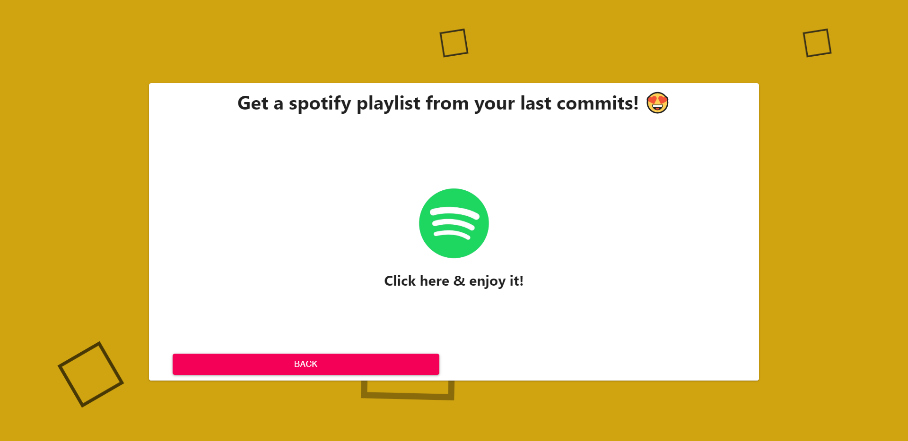

<br>
<p align="center">
  
</p>
<br>

[](http://hits.dwyl.io/AlbertSuarez/git-inspect)
[](https://GitHub.com/AlbertSuarez/git-inspect/stargazers/)
[](https://GitHub.com/AlbertSuarez/git-inspect/network/)
[](https://github.com/AlbertSuarez/git-inspect)
[](https://GitHub.com/AlbertSuarez/git-inspect/graphs/contributors/)
[](https://github.com/AlbertSuarez/git-inspect/blob/master/LICENSE)

[Demo](http://134.209.244.212:8085/) | [API Documentation](http://134.209.244.212:8084/ui) | [Devpost](https://devpost.com/software/git-inspect)

🐙 Do you think that you already know all about your GitHub user? Wrong answer. Git Inspect is gonna tell you. GitHub user information extractor built in [MamutHack'19](https://www.mamuthack.com).

## Contents

1. [Summary](#summary)
   1. [Inspiration](#inspiration)
   2. [What it does](#what-it-does)
   3. [How we built it](#how-we-built-it)
   4. [Challenges we ran into](#challenges-we-ran-into)
   5. [Accomplishments that we're proud of](#accomplishments-that-were-proud-of)
   6. [What we learned](#what-we-learned)
   7. [What's next for Git Inspect](#whats-next-for-git-inspect)
2. [Screenshots](#screenshots)
3. [Requirements](#requirements)
4. [Usage](#usage)
5. [Authors](#authors)
6. [License](#license)

## Summary

### Inspiration

The inspiration came really from a moment where we needed to know which was the language most used in our GitHub repositories, just for curiosity, and we couldn't find any website or tool able to do that on the Internet. Following the _hacker spirit_, we wanted to solve this concern with our own hands.

### What it does

Just from a GitHub user, our website is able to retrieve all the public information from the user and from their repositories from GitHub. Once that, the website shows information such as amount of repositories, commits, percentatges of the used languages, a list of all your repositories contributors and a lot more.

Also, we wanted to extract something new and unexpected from this data: a [Spotify](https://www.spotify.com/uk/) playlist! Retrieving as much information as we can from the user commits, Git Inspect creates a music playlist based on your GitHub public activity.

### How we built it

Frontend and backend are very different components connected by API requests and deployed with [Docker compose](https://docs.docker.com/compose/).

At frontend, we can see a [React](https://reactjs.org/) and [Redux](https://redux.js.org) application built with [TypeScript](http://www.typescriptlang.org). [Material UI](https://material-ui.com), [JQuery](https://jquery.com), [Node-Sass](https://github.com/sass/node-sass), [Chart.JS](https://www.chartjs.org/) and [Toastr](https://github.com/CodeSeven/toastr) are some of the most important used libraries in order to achieve the frontend that we planned when we started the project.

In the other side of the application, we have the backend which is implemented with [Python 3.7](https://www.python.org/downloads/release/python-372/). For creating the API that allows the communication between the two components, we have used [Flask](http://flask.pocoo.org/) and [OpenAPI](https://swagger.io/docs/specification/about/) (connected themselves with [Connexion](https://connexion.readthedocs.io/en/latest/) library), integrated with [Docker compose](https://docs.docker.com/compose/). This API is hosted using [uWSGI](https://uwsgi-docs.readthedocs.io/en/latest/) and [Nginx](https://www.nginx.com/) in a small [DigitalOcean](https://www.digitalocean.com/) droplet.

In order to achieve the goal of the project, we've integrated two APIs: [GitHub](https://developer.github.com/v3/) and [Spotify](https://developer.spotify.com/documentation/web-api/). The first one using [OAuth](https://oauth.net) authentification and the second one dealing with [OAuth2](https://oauth.net/2/). In total, this project hits 6 endpoints from the GitHub API and other 5 from the Spotify API, so 11 in total.

### Challenges we ran into

First of all, one member of the team had never worked with React (and even less with Redux), and the other one did very little work with backend stuff so it was kind a challenge to get out our comfort zone in order to help each other. Then, our main goal was to make something actually useful so we needed to develop a complete project, not only an script; that created several challenges like adding the functionality of the script to a website, also the website had to be intuitive and well-designed and everything had to work smoothly.

Since we wanted to deploy this project in a public domain for being used on the Internet, we were having a lot of issues trying to link the purchased domain with the Digital Ocean droplet, specially with the limit of the UAB eduroam network.

Also, as it's been known, OAuth2 authentification protocal is one of the most secure protocols (for not saying the most) but it's kinda difficult to understand and integrate properly in your application. And since we wanted to use Spotify API in this projet, we have had to deal with this stuff.

### Accomplishments that we're proud of

We are really proud with the final project we have developed. It is really useful and probably we will use it in the future. Our goal was to build something cool, and it's kinda like this. Looking at the [result](http://134.209.244.212:8085), we think that we've achieved it.

### What we learned

We have learnt how beautiful can be to be able to solve a problem with your own hands in just a weekend. Also, as we said, both of us have experience with frontend or backend but not the other one, so it was cool to learn from each other.

### What's next for Git Inspect

Git Inspect could evolve easily knowing the power of the data the GitHub has. We had more ideas to add to the project, such as representing your profile with a bunch of images (in the same way as music but with images) or even generating stories with your activity with ML models such as [GPT-2](https://openai.com/blog/better-language-models/). However, we hadn't time for implementing these ideas.

## Screenshots

This is how our project looks like unifying frontend and backend. If you want to see more, just check [our live demo](http://134.209.244.212:8085).









## Requirements

1. docker-compose

## Usage

To run the whole stack, please execute the following from the root directory:

1. Run the server as a docker container with docker-compose

    ```bash
    docker-compose up -d --build
    ```

## Authors

- [David Aleu](https://github.com/daleu)
- [Albert Suàrez](https://github.com/AlbertSuarez)

## License

MIT © Git Inspect
